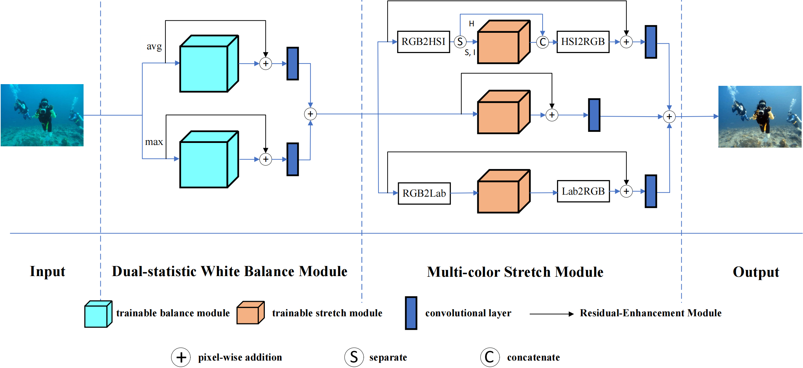
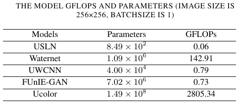
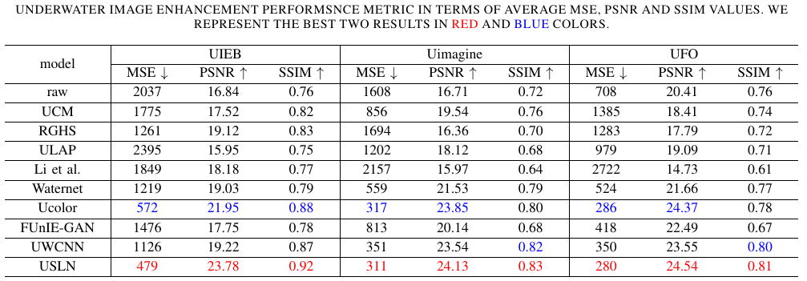

# USLN
USLN: A statistically guided lightweight network for underwater image enhancement via dual-statistic white balance and multi-color space stretch
Implementation: PyTorch

## overview

Our model consists of dual-statistic white balance module, multi-color space stretch module and residual-enhancement modules. The input of USLN is three-dimensional underwater image in which the pixel values is between 0 and 1. ‘convolutional layer’ has the kernel of size 3 × 3 and stride 1, which is used to merge enhanced images together.

## performance
Extensive experiments show that USLN significantly reduces the required network capacity (over 98%) and achieves state-of-the-art performance.

## train and test
if you want to train the model:\
1, put your datasets into corresponding folders ("images_train", "labels_train", "images_val", "labels_val")\
2, run train.py\
3, the checkpoints will be saved in "logs"

if you want to test the model:\
1, put your datasets into "images_test"\
2, run test.py (load model checkpoints from "logs" first)\
3, the result will be saved in "pred"
